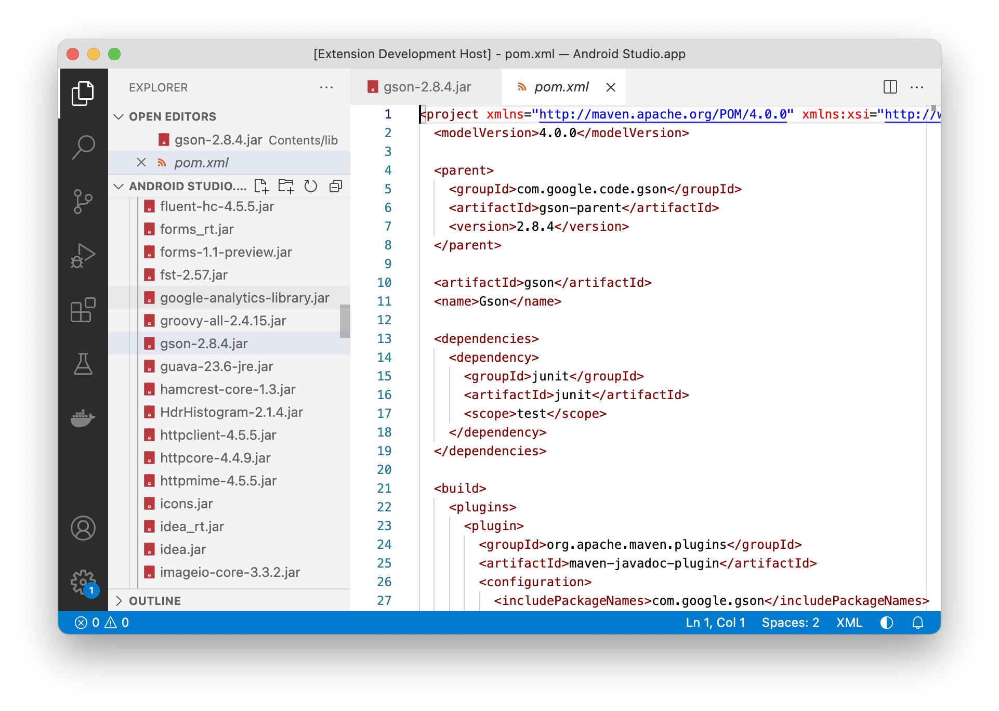

# JAR Viewer Extension for VS Code

Extension for VS Code that gives a quick peek inside a JAR file by listing all classes and files bundled inside the archive.

## Features

### JAR content view

Select or open a ```.jar``` file to get the content tree of the contained file- and package-structure in the editor view.


### File preview

Click on a file node in the content tree to open a preview of the file in a read only editor view.



## Contribution

For Bugs or feature requests please use the GitHub issues page https://github.com/wmanth/vscode-jar-viewer/issues.

## Release Notes

### 1.2.0

* Added support for nested jar archives

### 1.1.1

* Update open editor views when the jar file has changed
* Added *.srcjar, *.aar and *.war as supported file types

### 1.1.0

* Preview text files from the jar archive

### 1.0.2

* Preserve the vertical scroll position

### 1.0.1

* Highlight the hovered tree node
* Persist the folding state of tree nodes

### 1.0.0

Initial release of the JAR viewer extension.

