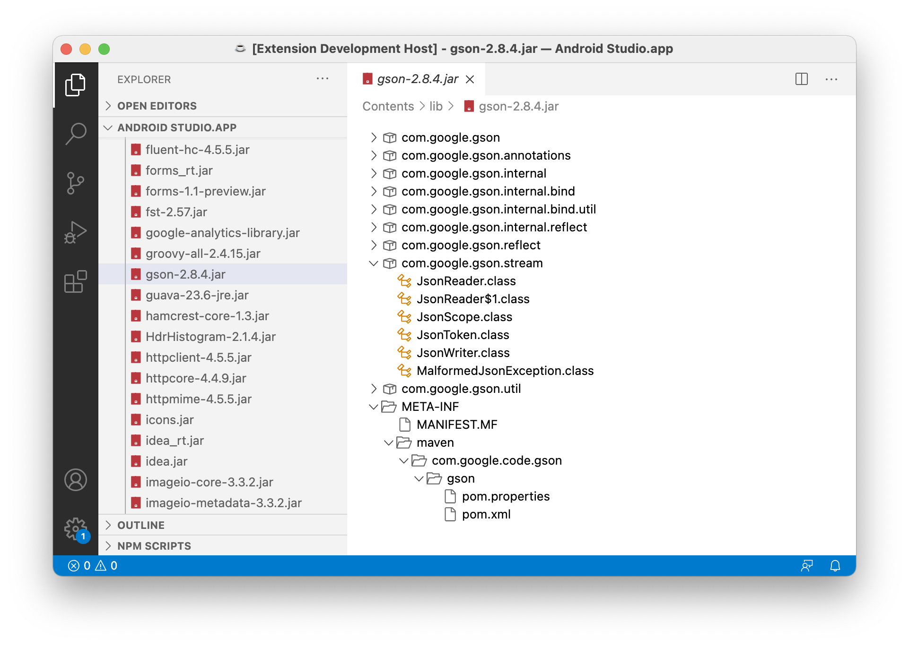

# JAR Viewer Extension for VS Code

[](https://github.com/wmanth/vscode-jar-viewer/actions/workflows/validate-main-branch.yaml)

Extension for VS Code that gives a quick peek inside a JAR file by listing all classes and files bundled inside the archive.

## Features

Select or open a ```.jar``` file to get a tree view of the contained file and package structure.



## Contribution

For Bugs or feature requests please use the GitHub issues page https://github.com/wmanth/vscode-jar-viewer/issues.

## Release Notes

### 1.0.0

Initial release of the JAR viewer extension.

